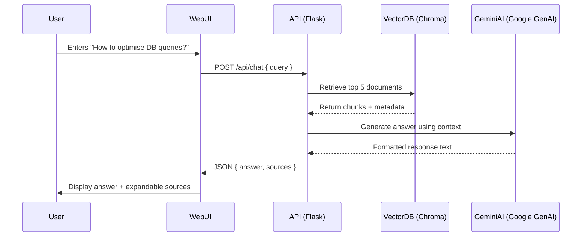
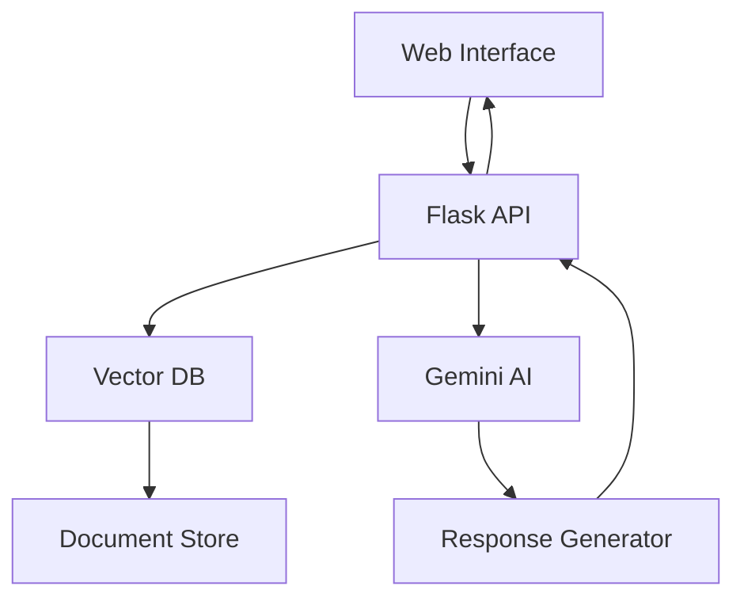
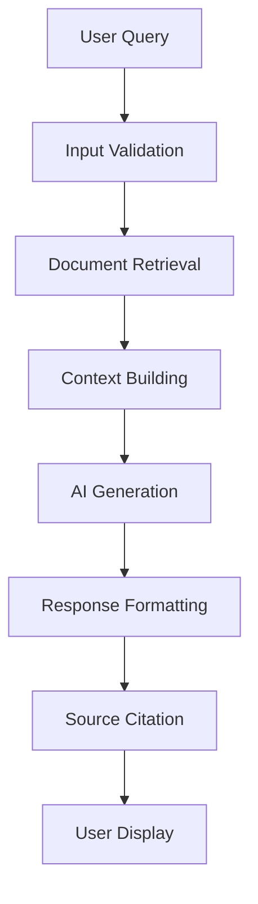

# RAG ChatBot Requirements Document

## 1. Functional Requirements

### 1.1 Core Functionality
- The system shall provide a web-based interface for users to interact with the chatbot
- The system shall process natural language queries from users
- The system shall retrieve relevant documents from the vector database
- The system shall generate context-aware responses using Google's Gemini AI
- The system shall display source citations for all provided information

### 1.2 User Interface Requirements
- The interface shall provide a clean, modern chat interface
- The interface shall display user queries and bot responses in a conversational format
- The interface shall show expandable source citations for each response
- The interface shall provide visual feedback during query processing
- The interface shall handle errors gracefully with user-friendly messages

### 1.3 API Requirements
- The system shall expose a REST API endpoint for chat functionality
- The API shall accept POST requests with JSON payloads
- The API shall return JSON responses with answer and source information
- The API shall include a health check endpoint
- The API shall implement CORS for cross-origin requests

### 1.4 Data Management
- The system shall maintain a vector database using Chroma
- The system shall use TensorFlow Hub embeddings for document similarity
- The system shall retrieve top 5 most relevant documents for each query
- The system shall persist the vector database between sessions

## 2. User Interactions

### 2.1 Query Submission
1. User enters a question in the chat interface
2. System validates the input
3. System processes the query through the RAG pipeline
4. System displays the response with source citations

### 2.2 Response Display
1. System shows the AI-generated answer
2. System provides expandable source citations
3. User can click on sources to view detailed information
4. User can ask follow-up questions

### 2.3 Error Handling
1. System displays appropriate error messages for invalid inputs
2. System handles API failures gracefully
3. System provides feedback for processing delays
4. System maintains chat history for context

## 3. System Architecture

### 3.1 User Interaction Workflow

### 3.2 High-Level System Architecture

### 3.3 Low-Level Application Flow

## 4. Technical Specifications

### 4.1 API Endpoints
- POST `/api/chat`
  - Input: JSON with `query` field
  - Output: JSON with `answer` and `sources` fields
- GET `/api/health`
  - Output: JSON with `status` field

### 4.2 Configuration
- Vector DB: Chroma with TensorFlow Hub embeddings
- AI Model: Google Gemini 1.5 Flash
- Top K documents: 5
- Temperature: 0.1
- Max output tokens: 1024

### 4.3 Performance Requirements
- Response time: < 3 seconds for typical queries
- Concurrent users: Support for multiple simultaneous users
- Error rate: < 1% for valid queries
- Availability: 99.9% uptime

## 5. Security Requirements

### 5.1 API Security
- CORS enabled for specified origins
- Input validation and sanitization
- Rate limiting for API endpoints
- Secure API key management

### 5.2 Data Security
- Secure storage of vector database
- Protected access to AI model credentials
- Safe handling of user queries
- Proper error message sanitization 